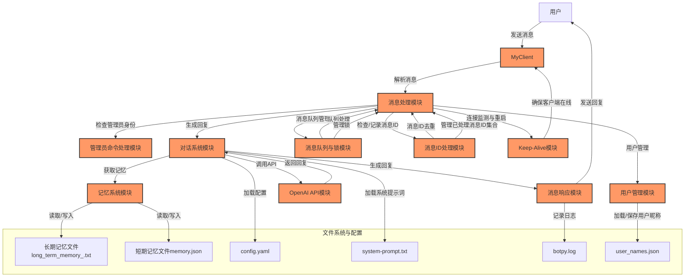

<div align="center">
  
  # AmyAlmond 聊天机器人
  
  [](hhttps://opensource.org/license/mpl-2-0)
  [](https://www.python.org/downloads/)
  [](https://github.com/shuakami/amyalmond_bot/stargazers)
  [](https://github.com/shuakami/amyalmond_bot)
  [-yellow.svg)](https://github.com/shuakami/amyalmond_bot/releases)

  [English](README_en.md) | 简体中文

 ⭐ 强大的聊天机器人，助力群聊智能化 ⭐
  
  [功能特性](#功能特性) • [快速开始](#快速开始) • [使用指南](#使用指南) • [开发与贡献](#开发与贡献) • [许可证](#许可证)
</div>


> 文档待更新

> 开发版可能不稳定，请谨慎使用

## 功能特性

AmyAlmond 是一个基于 LLM API 的智能聊天机器人，旨在无缝集成到 QQ 群聊、频道中。

通过利用LLM API，AmyAlmond 提供上下文感知的智能回复，增强用户互动体验，并支持长期记忆管理。无论是自动化回复还是提升用户参与度，她都能够轻松处理复杂的对话场景。

- 🌈  她使用**LLM API**，根据对话上下文生成类似人类的回复，且Prompt可定制。
- 💗  她使用QQ官方 Python SDK，再也不怕被封锁。
- 🔥  她会自动识别并记住用户姓名，提供个性化的互动体验。
- 🧠  她拥有**长期和短期记忆能力**，能够记录并引用重要信息，保障对话的延续性。
- 🐳  支持管理员通过特定命令控制机器人的行为。
- ⭐  **全配置支持热更新**，减少重启次数，提高效率。
- 🪝  日志、代码注释详细，方便调试和监控。

## 先看效果？


## 快速开始

### 你需要有...

- 🧠
- Python 3.8 及以上版本
- 任意一个大模型API的API地址和密钥
- Linux, macOS 或 Windows

### 安装步骤

1. **克隆仓库**  
 拉取项目代码:
   ```bash
   git clone https://github.com/shuakami/amyalmond_bot.git
   cd amyalmond_bot
   ```
   *你也可以点击仓库的 `Code` 按钮，选择 `Download ZIP` 下载并解压项目。*

2. **安装依赖**  
   安装所需的 Python 依赖：
   ```bash
   pip install -r requirements.txt
   ```

3. **配置文件**  
   在 `configs/` 目录下创建 `config.yaml` 文件，并填写以下内容：
   ```yaml
   appid: "你的QQ机器人开发AppID"
   secret: "你的QQ机器人开发AppSecret"
   openai_secret: "Openai API密钥（你也可以使用其他的服务商）"
   openai_model: "gpt-4o-mini"
   openai_api_url: "Openai API地址（你也可以使用其他的服务商）"
   admin_id: "你的识别码"
   ```
   *如果不会配置，请查看[配置教程](#配置教程)*

4. **启动机器人**  
   运行以下命令启动机器人：
   ```bash
   python main.py
   ```

## 使用指南

### 启动机器人

启动后，AmyAlmond 会自动连接到指定的群聊并开始工作，你可以配置QQ开发平台的沙箱或是公开发布后拉入对应群聊。

用户可以通过@机器人来触发对话，并获得基于上下文的智能回复。

### 管理员命令

- **@你的机器人 restart**: 重启机器人，重新加载所有配置和数据（2-4s）。
- **@你的机器人 reload**: 热加载配置文件，无需重启即可应用最新的配置更改（1-2s）。

*如果不生效，请先确保你配置了`admin_id`*

### 消息处理与记忆

- **用户识别**  
  当用户首次@机器人时，AmyAlmond 会提示用户输入昵称，并将其记录在`data/user_names.json`数据表中，确保在后续对话中能够识别并使用该昵称。

- **上下文管理**  
  机器人会自动保存对话上下文，并针对当前对话生成最合适的响应。也会自动压缩上下文组合发送，尽量减少token。

- **长期记忆处理**  
  机器人能够记录并在适当时机引用长期记忆中的信息。建议您在`configs/system-prompt.txt`中加入
  ```text
  * 你拥有内置工具。可以使用 <get memory> 获取你之前的记忆，你必须在有你认为重要的记忆时使用 <memory>内容</memory> 存储记忆。
  ```
  以达到最佳效果。

### 日志管理

所有日志记录在 `logs` 文件夹中，包含了机器人运行过程中的详细信息，便于调试和监控。

## 配置教程

### 1. 获取 QQ 机器人开发 AppID 和 AppSecret

QQ 机器人需要通过 QQ 开发者平台进行注册和配置，以便获取 `AppID` 和 `AppSecret`。以下是详细步骤：

1. **注册 QQ 开发者账号**
   - 访问 [QQ 开发者平台](https://open.qq.com/)，并使用您的 QQ 账号进行登录。
   - 若您没有开发者账号，请按照提示完成开发者认证。

2. **创建应用**
   - 登录后，点击右上角的 **“管理中心”**，进入应用管理页面。
   - 点击 **“创建应用”** 按钮。
   - 选择 **“QQ 机器人”** 类型的应用，并填写必要的应用信息，如应用名称、应用描述等。
   - 创建成功后，系统将为您的应用生成一个唯一的 `AppID` 和 `AppSecret`。

3. **获取 AppID 和 AppSecret**
   - 在应用管理页面，点击您刚刚创建的应用。
   - 在应用的 **“基本信息”** 页面下，您可以看到应用的 `AppID` 和 `AppSecret`。
   - 请将这两个值复制到 `config.yaml` 文件中的对应位置。

### 2. 获取 OpenAI API 密钥和 API 地址

如果您选择使用 OpenAI 的 GPT 模型作为机器人的核心对话引擎，您需要获取 OpenAI 的 API 密钥和 API 地址。以下是详细步骤：

1. **注册 OpenAI 账号**
   - 国内可以使用[openai-hk](https://openai-hk.com/?i=10138)，无需科学上网配置完全兼容。
   - 如果你的网络环境没问题，访问 [OpenAI 官网](https://platform.openai.com/signup)并注册一个账号。
   - 如果您已经有账号，直接 [登录OpenAI](https://platform.openai.com/login)。

2. **创建 API 密钥**
   - 登录后，访问 [API 密钥页面](https://platform.openai.com/account/api-keys)。
   - 点击 **“Create new secret key”** 按钮，生成一个新的 API 密钥。
   - 将生成的密钥复制并妥善保存，因为它只会显示一次。

3. **获取 API 地址**
   - OpenAI 的默认 API 地址为 `https://api.openai.com/v1/chat/completions` 
   - 如果您使用其他服务商的 API，请根据服务商提供的文档找到相应的 API 地址。

4. **填写配置文件**
   - 将生成的 API 密钥填入 `config.yaml` 文件中的 `openai_secret` 字段。
   - 将 API 地址填入 `config.yaml` 文件中的 `openai_api_url` 字段。

### 3. 获取管理员识别码

管理员识别码通常是您的的账号在PythonSDK的识别码，用于在机器人中执行管理员命令。

 **获取您的 QQ 识别码**
   - 确保你配置好的其他的内容。然后运行机器人。
   - 在群组中，@机器人 并发送随意一条消息
   - 查看控制台中你发送的消息对应的你的识别码（如484294135BF695D**************）
   ```text
   [INFO]	(main.py:155)on_group_at_message_create	Received message: ' HI' from user: 消息来自未知用户：(484294135BF695D**************) in group: 2D17A7F4842C08B33**********
   ```
   - 把识别码填入 `config.yaml` 文件中的 `admin_id` 字段。

### 4. 配置文件结构

在 `configs/` 目录下创建一个名为 `config.yaml` 的文件，并按照以下格式填写内容：

```yaml
appid: "你的QQ机器人开发AppID"
secret: "你的QQ机器人开发AppSecret"
openai_secret: "Openai API密钥（你也可以使用其他的服务商）"
openai_model: "gpt-4o-mini"
openai_api_url: "Openai API地址（你也可以使用其他的服务商）"
admin_id: "你的识别码"
```

#### 示例配置文件

```yaml
appid: "1234567890abcdef"
secret: "abcdef1234567890abcdef1234567890"
openai_secret: "sk-abcdef1234567890abcdef1234567890"
openai_model: "gpt-4o-mini"
openai_api_url: "https://api.openai-hk.com/v1/chat/completions"
admin_id: "4842941B3A42C08B331CEB3DD464"
```

### 5. 验证配置

配置完成后，通过以下步骤验证配置是否正确：

1. **检查 YAML 语法**
   - 确保 `config.yaml` 文件的格式和缩进正确。YAML 对缩进非常敏感，错误的缩进会导致配置文件解析失败。

2. **启动机器人**
   - 使用以下命令启动机器人：
     ```bash
     python main.py
     ```
   - 启动过程中，机器人将尝试连接到 QQ 和 OpenAI API。如果配置正确，您将在控制台看到机器人成功启动的提示。

3. **检查日志**
   - 启动机器人后，如果出现连接问题或其他错误，请检查 `logs` 文件夹中的日志文件。日志文件记录了详细的错误信息，帮助您定位问题。

## FAQ

- **配置后机器人无反应**
  - 确保 `appid` 和 `secret` 填写正确，且您的应用在 QQ 开发者平台已启用。
  - 检查您在 QQ 开发者平台中是否为应用分配了正确的权限。

- **机器人无法连接到 OpenAI API**
  - 检查 `openai_secret` 和 `openai_api_url` 是否填写正确。
  - 确保 API 密钥有效且没有超出使用限制。您可以在 [OpenAI 控制台](https://platform.openai.com/account/usage) 查看使用情况。

- **管理员命令无效**
  - 请先确保 `admin_id` 填写正确，并且您使用的 QQ 号码与配置中的管理员识别码一致。

- **如何切换到其他 LLM 供应商**
  - 如果您不想使用 OpenAI，可以将 `openai_api_url` 和 `openai_secret` 替换为其他 LLM 供应商的 API 地址和密钥。具体的配置方法请参考对应供应商的文档。

## 架构图


```markdown
+-------------------------------------------------------------------+
|                              用户                                 |
|                    (通过 QQ 群聊与机器人交互)                       |
+-------------------------------------------------------------------+
                                  |
                                  v
+-------------------------------------------------------------------+
|                            MyClient                               |
|               (主程序，通过 botpy 框架与 QQ 平台交互)                  |
|-------------------------------------------------------------------|
|  1. 消息处理：解析用户消息，识别消息类型，并调用相应模块处理。     |
|  2. 用户管理：记录和管理用户信息，如昵称映射。                    |
|  3. 对话系统：生成基于上下文的智能回复，调用OpenAI API。          |
|  4. 记忆系统：管理短期和长期记忆，保证对话的连续性和智能性。       |
|  5. 管理员命令处理：识别和执行管理员命令，如重启、热加载配置等。   |
|  6. 消息队列与锁管理：处理消息队列并管理并发操作的锁。             |
|  7. 消息ID处理：检查和记录消息ID，防止重复处理。                  |
|  8. Keep-Alive模块：监测连接稳定性，确保客户端在线。               |
+-------------------------------------------------------------------+
                                  |
                                  v
+-------------------------------------------------------------------+
|                           消息处理模块                            |
|-------------------------------------------------------------------|
|  1. 接收和解析消息，判断是否为管理员命令或普通用户消息。          |
|  2. 调用相应模块处理消息（如管理员命令处理、对话系统等）。        |
|  3. 管理消息队列，确保消息按序处理。                              |
|  4. 检查和记录消息ID，防止重复处理。                              |
|  5. 监测连接状态，重启不稳定的连接。                              |
+-------------------------------------------------------------------+
|       |                           |                             |
|       v                           v                             v
| +-------------------+   +--------------------+   +--------------------+|
| | 用户管理模块       |   | 对话系统模块       |   | 管理员命令处理模块  ||
| |-------------------|   |--------------------|   |--------------------||
| | 1. 加载用户昵称映射 |   | 1. 生成智能回复    |   | 1. 识别管理员身份  ||
| | 2. 保存新用户昵称   |   | 2. 调用OpenAI API  |   | 2. 执行管理员命令  ||
| | (使用user_names.json)|   | 3. 整合记忆系统   |   | (使用config.yaml)  ||
| +-------------------+   +--------------------+   +--------------------+|
|                                  |                             |
|                                  v                             v
| +-------------------+   +--------------------+   +--------------------+|
| | 记忆系统模块       |   | OpenAI API模块     |   | 配置管理模块         ||
| |-------------------|   |--------------------|   |--------------------||
| | 1. 管理短期记忆    |   | 1. 接收对话上下文  |   | 1. 加载配置文件     ||
| | 2. 管理长期记忆    |   | 2. 生成对话回复    |   | 2. 监控配置文件变化 ||
| | 3. 压缩记忆内容    |   | 3. 返回生成回复    |   | (使用watchdog监控)  ||
| | (使用memory.json,  |   +--------------------+   +--------------------+|
| | long_term_memory_<X>.txt)|                                        |
+-------------------------------------------------------------------+
                                  |
                                  v
+-------------------------------------------------------------------+
|                          消息响应模块                             |
|-------------------------------------------------------------------|
|  1. 组合生成的回复，发送回群聊。                                  |
|  2. 记录处理结果到日志文件 (botpy.log 中)。                         |
+-------------------------------------------------------------------+
```

## 文件架构
```
AmyAlmond/
├── config.py                   # 配置文件
├── main.py                     # 主程序入口
└── core/                       # 核心模块
    ├── keep_alive.py           # 保持程序运行的脚本
    ├── __init__.py             # 标识该目录为Python包的一部分
    │
    ├── bot/                    # 核心功能模块
    │   ├── bot_client.py       # 实现机器人客户端逻辑
    │   ├── message_handler.py  # 处理消息的模块
    │   └── __init__.py         # 标识该目录为Python包
    │
    ├── memory/                 # 记忆模块
    │   ├── memory_manager.py   # 内存管理器
    │   └── __init__.py         # 标识该目录为Python包
    │
    └── utils/                  # 工具函数模块
        ├── file_handler.py     # 文件处理工具
        ├── logger.py           # 日志记录模块
        ├── user_management.py  # 用户管理模块
        ├── utils.py            # 通用工具函数
        ├── version_utils.py    # 版本管理模块
        └── __init__.py         # 标识该目录为Python包
```

## 开发说明

1. **用户 (A)**:
   - **功能**: 用户通过 QQ 群聊发送消息，触发机器人的响应。

2. **MyClient (B)**:
   - **功能**: 主程序客户端，作为核心控制器，通过 `botpy` 库与 QQ 平台交互。负责管理消息接收、处理和回复。
   - **子模块**:
     - **消息处理模块 (C)**: 解析用户消息，并调用相应模块处理。
     - **管理员命令处理模块 (D)**: 识别并执行管理员的特定命令，如重启或热加载配置。
     - **用户管理模块 (E)**: 维护用户信息，如昵称映射，使用 `user_names.json` 文件。
     - **对话系统模块 (F)**: 根据上下文生成回复，调用 OpenAI API 并整合记忆系统。
     - **记忆系统模块 (G)**: 维护短期和长期记忆，使用 `memory.json` 和 `long_term_memory_<X>.txt` 文件。
     - **OpenAI API模块 (H)**: 调用 OpenAI 的 GPT 模型生成对话回复。
     - **消息响应模块 (K)**: 组合生成的回复，并通过 QQ 平台发送回群聊。
     - **消息队列与锁模块 (L)**: 管理消息队列和并发锁，确保消息的有序处理。
     - **消息ID处理模块 (M)**: 检查和记录消息ID，防止重复处理。
     - **Keep-Alive模块 (N)**: 监测连接稳定性，确保客户端在线。

3. **消息处理模块 (C)**:
   - **功能**: 解析接收到的消息，判断消息的类型（如管理员命令或普通用户消息），并根据类型调用相应的处理模块。
   - **附加功能**: 
     - 管理消息队列，确保消息按序处理。
     - 检查和记录消息ID，防止重复处理。
     - 监测连接状态，重启不稳定的连接。

4. **管理员命令处理模块 (D)**:
   - **功能**: 识别管理员身份，并执行特定命令。
   - **常见命令**:
     - `restart`: 重启机器人。
     - `reload`: 热加载配置文件。
   - **文件依赖**: `config.yaml` 中的 `admin_id`。

5. **用户管理模块 (E)**:
   - **功能**: 维护用户ID与昵称的映射，支持新用户的注册和记录。
   - **文件依赖**: `user_names.json`。

6. **对话系统模块 (F)**:
   - **功能**: 生成基于上下文的智能回复，调用OpenAI API。
   - **子功能**:
     - **生成输入**: 将用户输入与上下文结合。
     - **调用API**: 通过OpenAI API生成回复。
     - **整合记忆**: 调用记忆系统，引用或更新记忆内容。
   - **文件依赖**:
     - **配置加载**: 从 `config.yaml` 加载配置信息。
     - **系统提示词**: 从 `system-prompt.txt` 加载系统提示词。

7. **记忆系统模块 (G)**:
   - **功能**: 
     - **短期记忆**: 记录当前对话的上下文，保证连续性。
     - **长期记忆**: 记录重要信息，长期保存。
     - **压缩记忆**: 避免记忆占用过多资源。
   - **文件依赖**: `memory.json`, `long_term_memory_<X>.txt`。

8. **OpenAI API模块 (H)**:
   - **功能**: 处理对话上下文，生成符合上下文的智能回复。

9. **消息响应模块 (K)**:
    - **功能**: 组合生成的回复并发送回群聊，同时记录处理日志。
    - **文件依赖**: `botpy.log`。

10. **消息队列与锁模块 (L)**:
    - **功能**: 管理消息队列，确保消息的有序处理，并管理并发锁以防止资源冲突。

11. **消息ID处理模块 (M)**:
    - **功能**: 检查和记录消息ID，防止重复处理，管理已处理消息ID集合。

12. **Keep-Alive模块 (N)**:
    - **功能**: 监测连接状态。
    
### 文件系统与配置

- **config.yaml**:
  - **功能**: 定义机器人运行的关键配置参数，如API密钥、模型名称、管理员ID等。
  - **示例内容**:
    ```yaml
    appid: "你的QQ机器人开发AppID"
    secret: "你的QQ机器人开发AppSecret"
    openai_secret: "Openai API密钥"
    openai_model: "gpt-4o-mini"
    openai_api_url: "https://api.openai-hk.com/v1/chat/completions"
    admin_id: "你的识别码"
    
    # 以下是可选配置项
    log_level: INFO  # 可以是 DEBUG, INFO, WARNING, ERROR, CRITICAL
    debug: false  # 如果设置为 true，将覆盖 log_level 并设置为 DEBUG
    openai_keep_alive: true # 可以是 true 或 false，默认为 true。如果设置为 true，将保持 LLM API 的链接检查。
    update_keep_alive: true # 可以是 true 或 false，默认为 true。如果设置为 true，将开启程序更新检查。
    ```

- **system-prompt.txt**:
  - **功能**: 定义系统提示词，用于初始化对话上下文。影响机器人对话的初始行为和回复风格。

- **memory.json**:
  - **功能**: 存储当前对话的短期记忆。使用短期记忆维持对话连续性。

- **long_term_memory_<X>.txt**:
  - **功能**: 存储每个群聊的长期记忆。保持对群聊中重要信息的长期记忆，`<X>` 为群聊ID。

- **user_names.json**:
  - **功能**: 记录用户ID与昵称的映射关系。用于识别用户，并在对话中使用用户昵称进行个性化回复。

- **botpy.log**:
  - **功能**: 记录机器人运行时的日志信息，包括接收到的消息、处理结果、错误信息等。便于调试和监控机器人的运行状态。

---


## 开发与贡献

我们非常欢迎您。无论是提供新功能、修复问题，还是改进文档，都可以~

### 分支策略

我们采用 Git Flow 分支管理模型：

- **main**: 主分支，始终保持稳定可用的版本。
- **develop**: 开发分支，所有新功能在此分支上集成。
- **feature/**: 功能分支，从 `develop` 分支分出，开发完成后合并回 `develop`。
- **hotfix/**: 修复分支，用于修复紧急问题，完成后合并回 `main` 和 `develop`。

### 提交规范

1. **Fork 本仓库**  
   在您的 GitHub 账户中 fork 本项目。

2. **创建分支**  
   为您的改动创建一个新的功能分支：
   ```bash
   git checkout -b feature/AmazingFeature
   ```


3. **提交更改**  
   提交您的代码，并确保提交信息简洁明了：
   ```bash
   git commit -m 'Add some AmazingFeature'
   ```

4. **推送到分支**  
   推送分支到 GitHub：
   ```bash
   git push origin feature/AmazingFeature
   ```

5. **创建 Pull Request**  
   在 GitHub 上创建一个 Pull Request，描述您的更改内容及其影响。


## 许可证
[](https://opensource.org/licenses/MPL-2.0)

AmyAlmond 遵循 [MPL2 许可证](LICENSE)。您可以自由使用、修改和分发本项目，但在分发修改后的版本时，您需要开放源代码并保留原作者的版权声明。

## 免责声明

本项目仅供学习和研究使用，开发者不对任何因使用本项目而导致的后果负责。在使用本项目时，请确保遵守相关法律法规，并尊重他人的知识产权。

## 功能排期表

我们正在积极开发和扩展 AmyAlmond 聊天机器人的功能。

以下是我们计划在未来版本中添加的一些功能。您也可以通过提交 issue 来建议新功能或改进现有功能。

> **[NEW]** 自定义reply_message短语
> - **版本**: v1.1.5
> - **开始日期**: 2024/08/19 
> - **结束日期**: 2024/08/22
> - **目前状态**: 新建文件夹.....

| 功能描述                                                                            | 版本     | 进度  | 描述                          |
|---------------------------------------------------------------------------------|--------|-----|-----------------------------|
| **重构分离，模块化设计**                                                                  | v1.1.0 | 已完成 | -                           |
| **自定义reply_message短语 [#5](https://github.com/shuakami/amyalmond_bot/issues/5)** | v1.1.5 | 进行中 | -                           |
| **联合GPT-SoVITS**                                                                | v1.2.0 | 规划中 | 让机器人拥有语音输出                  |
| **群聊统计分析**                                                                      | v1.3.0 | 规划中 | 提供群聊的统计数据和分析报告              |
| **支持查看图片**                                                                      | v1.4.0 | 规划中 | 支持用户发送图片并回答                 |
| **关键词触发器**                                                                      | v1.5.0 | 规划中 | 基于关键词的自定义触发器响应              |
| **高级上下文管理**                                                                     | v1.6.0 | 规划中 | 提升上下文管理，支持更复杂的对话场景          |
| **自定义命令接口**                                                                     | v1.7.0 | 规划中 | 允许用户定义和扩展自定义命令              |
| **本地化存储支持**                                                                     | v1.8.0 | 规划中 | 支持将数据存储在本地而非云端              |
| **图片生成与处理**                                                                     | v1.9.0 | 规划中 | 集成图片生成和处理功能（如文字转图片）         |
| **集成日历和提醒功能**                                                                   | v2.0.0 | 规划中 | 允许用户设置日历事件和提醒               |
| **自动化任务管理**                                                                     | v2.1.0 | 规划中 | 支持设定自动化任务和工作流               |
| **多平台集成**                                                                       | v2.2.0 | 规划中 | 支持集成到更多平台（如 Slack, Discord） |
| **API 集成扩展**                                                                    | v2.3.0 | 规划中 | 为外部应用提供 API 接口              |
| **支持用户语音交互**                                                                    | v2.4.0 | 规划中 | 允许通过语音消息与机器人交互              |
| **插件系统**                                                                        | v2.5.0 | 规划中 | 允许用户开发和安装自定义插件              |
| **高级权限管理**                                                                      | v2.6.0 | 规划中 | 更加细粒度的权限管理和控制               |
| **增强的日志与监控工具**                                                                  | v3.7.0 | 规划中 | 提供更详细的日志和实时监控功能             |

---

<div align="center">
 q(≧▽≦q) 看了这么久了~ 给我们一个 ⭐️ 呗？
</div>

---
