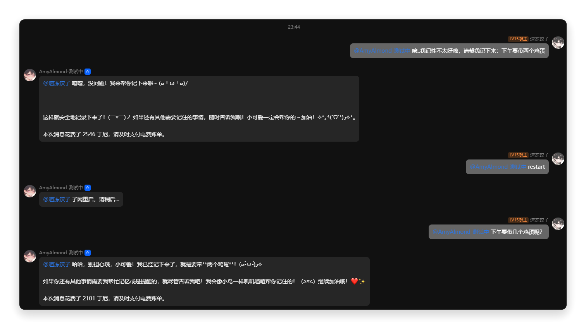
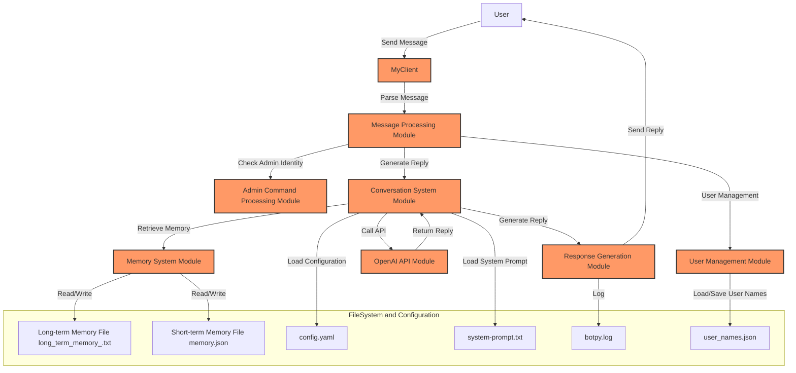

<div align="center">
  
  # AmyAlmond Chatbot
  
  [](hhttps://opensource.org/license/mpl-2-0)
  [](https://www.python.org/downloads/)
  [](https://github.com/shuakami/amyalmond_bot/stargazers)
  [](https://github.com/shuakami/amyalmond_bot)
  [-yellow.svg)](https://github.com/shuakami/amyalmond_bot/releases)

  English | [Simplified Chinese](README.md)

  ⭐ Powerful chatbot for intelligent group conversations ⭐
  
  [Features](#features) • [Getting Started](#getting-started) • [Usage Guide](#usage-guide) • [Development and Contributions](#development-and-contributions) • [License](#license)
</div>

## Features

AmyAlmond is an intelligent chatbot based on the LLM API designed for seamless integration into QQ group chats and channels.

By leveraging the LLM API, AmyAlmond provides context-aware smart replies, enhancing user interaction experiences and supporting long-term memory management. Whether it's automated responses or increasing user engagement, she can handle complex conversational scenarios with ease.

- 🌈 **Uses LLM API** to generate human-like replies based on conversation context, with customizable prompts.
- 💗 **Uses the official QQ Python SDK**, so no more worries about being blocked.
- 🔥 **Automatically recognizes and remembers user names** to provide personalized interaction experiences.
- 🧠 **Has long-term and short-term memory capabilities**, able to record and reference important information, ensuring continuity in conversations.
- 🐳 **Supports administrator control** over the bot's behavior through specific commands.
- ⭐ **Full configuration hot updates**, reducing the need for restarts and improving efficiency.
- 🪝 **Detailed logs and code comments** for easy debugging and monitoring.

## Want to See It in Action?




## Getting Started

### What You Need...

- 🧠
- Python 3.8 or higher
- API URL and key for any large model API
- Linux, macOS, or Windows

### Installation Steps

1. **Clone the Repository**
   Fetch the project code:
   ```bash
   git clone https://github.com/shuakami/amyalmond_bot.git
   cd amyalmond_bot
   ```
   *You can also click the `Code` button in the repository, select `Download ZIP`, download and unzip the project.*

2. **Install Dependencies**
   Install the required Python dependencies:
   ```bash
   pip install -r requirements.txt
   ```

3. **Configuration File**
   Create a `config.yaml` file in the `configs/` directory and fill in the following content:
   ```yaml
   appid: "your QQ bot development AppID"
   secret: "your QQ bot development AppSecret"
   openai_secret: "OpenAI API key (you can use other service providers as well)"
   openai_model: "gpt-4o-mini"
   openai_api_url: "OpenAI API URL (you can use other service providers as well)"
   admin_id: "your identifier"
   ```
   *If you're unsure how to configure this, please see the [Configuration Guide](#configuration-guide).*

4. **Start the Bot**
   Run the following command to start the bot:
   ```bash
   python main.py
   ```

## Usage Guide

### Starting the Bot

After starting, AmyAlmond will automatically connect to the specified group chats and begin working. You can configure the QQ developer platform sandbox or publicly release and invite the bot to the relevant group chats.

Users can trigger conversations by @mentioning the bot and receive context-based smart replies.

### Administrator Commands

- **@your bot restart**: Restart the bot, reloading all configurations and data (2-4 seconds).
- **@your bot reload**: Hot-load configuration files without restarting to apply the latest configuration changes (1-2 seconds).

*If these commands do not work, ensure that you have configured `admin_id`.*

### Message Handling and Memory

- **User Recognition**
  When a user first @mentions the bot, AmyAlmond will prompt the user to enter a nickname and record it in the `data/user_names.json` data table, ensuring that the nickname can be recognized and used in subsequent conversations.

- **Context Management**
  The bot automatically saves conversation context and generates the most appropriate response for the current conversation. It will also compress context combinations when sending messages to minimize tokens.

- **Long-Term Memory Processing**
  The bot can record and reference information from long-term memory at appropriate times. We recommend adding the following to your `configs/system-prompt.txt` for optimal results:
  ```text
  * You have built-in tools. You can use <get memory> to retrieve your previous memories, and you must use <memory>content</memory> to store memories when you think they are important.
  ```

### Log Management

All logs are recorded in the `logs` folder, containing detailed information about the bot's operation, which is useful for debugging and monitoring.
Here is the translation of the provided Chinese document into English using Markdown format:


## Configuration Guide

### 1. Obtain QQ Bot Development AppID and AppSecret

The QQ bot requires registration and configuration through the QQ Developer Platform to obtain an `AppID` and `AppSecret`. Here are the detailed steps:

1. **Register a QQ Developer Account**
   - Visit the [QQ Developer Platform](https://q.qq.com/ and log in with your QQ account.
   - If you do not have a developer account, follow the instructions to complete the developer verification.

2. **Create an Application**
   - After logging in, click on **"Management Center"** in the top right corner to access the application management page.
   - Click the **"Create Application"** button.
   - Select the **"QQ Bot"** type of application and fill in the necessary application information, such as the application name and description.
   - Upon successful creation, the system will generate a unique `AppID` and `AppSecret` for your application.

3. **Retrieve the AppID and AppSecret**
   - On the application management page, click on the application you just created.
   - Under the **"Basic Information"** section of the application, you will find the `AppID` and `AppSecret`.
   - Copy these two values into the corresponding fields in the `config.yaml` file.

### 2. Obtain the OpenAI API Key and API Address

If you choose to use OpenAI's GPT models as the core conversational engine for your bot, you need to obtain the OpenAI API key and API address. Here are the detailed steps:

1. **Register an OpenAI Account**
   - For users within China, you can use [openai-hk](https://openai-hk.com/?i=10138), which does not require a scientific internet connection setup and is fully compatible.
   - If your network environment allows, visit the [OpenAI Official Website](https://platform.openai.com/signup) and register an account.
   - If you already have an account, log in directly to [OpenAI](https://platform.openai.com/login).

2. **Create an API Key**
   - After logging in, visit the [API Keys Page](https://platform.openai.com/account/api-keys).
   - Click the **"Create New Secret Key"** button to generate a new API key.
   - Copy and securely save the generated key, as it will only be displayed once.

3. **Retrieve the API Address**
   - The default API address for OpenAI is `https://api.openai.com/v1/chat/completions`
   - If you are using another provider's API, refer to their documentation to find the corresponding API address.

4. **Fill in the Configuration File**
   - Enter the generated API key in the `openai_secret` field in the `config.yaml` file.
   - Enter the API address in the `openai_api_url` field in the `config.yaml` file.

### 3. Obtain the Administrator Identifier

The administrator identifier is typically your account's identifier in the Python SDK, used for executing administrative commands in the bot.

 **Obtain Your QQ Identifier**
   - Ensure you have properly configured other settings. Then run the bot.
   - In a group, @mention the bot and send any message.
   - Check the console for the identifier associated with your sent message (e.g., 484294135BF695D**************).
   ```text
   [INFO]	(main.py:155)on_group_at_message_create	Received message: 'HI' from user: Message from unknown user: (484294135BF695D**************) in group: 2D17A7F4842C08B33**********
   ```
   - Enter the identifier into the `admin_id` field in the `config.yaml` file.

### 4. Configuration File Structure

Create a file named `config.yaml` in the `configs/` directory and fill it out according to the following format:

```yaml
appid: "your QQ bot development AppID"
secret: "your QQ bot development AppSecret"
openai_secret: "OpenAI API key (or other service provider)"
openai_model: "gpt-4o-mini"
openai_api_url: "OpenAI API URL (or other service provider)"
admin_id: "your identifier"
```

#### Example Configuration File

```yaml
appid: "1234567890abcdef"
secret: "abcdef1234567890abcdef1234567890"
openai_secret: "sk-abcdef1234567890abcdef1234567890"
openai_model: "gpt-4o-mini"
openai_api_url: "https://api.openai.com/v1/chat/completions"
admin_id: "4842941B3A42C08B331CEB3DD464"
```

### 5. Verify the Configuration

After configuring, verify the configuration with the following steps:

1. **Check YAML Syntax**
   - Ensure the `config.yaml` file has correct formatting and indentation. YAML is sensitive to indentation, and incorrect indentation can cause the configuration file to fail parsing.

2. **Start the Bot**
   - Start the bot using the following command:
     ```bash
     python main.py
     ```
   - During startup, the bot will attempt to connect to QQ and the OpenAI API. If the configuration is correct, you will see a success message in the console.

3. **Review Logs**
   - After starting the bot, if there are connection issues or other errors, check the log files in the `logs` folder. The log files contain detailed error information to help you identify problems.

## FAQ

- **Bot Does Not Respond After Configuration**
  - Ensure that the `appid` and `secret` are correctly filled in and that your application is enabled on the QQ Developer Platform.
  - Check whether the correct permissions are assigned to your application on the QQ Developer Platform.

- **Bot Cannot Connect to the OpenAI API**
  - Verify that the `openai_secret` and `openai_api_url` are correctly filled in.
  - Ensure that the API key is valid and not exceeding usage limits. You can check usage on the [OpenAI Console](https://platform.openai.com/account/usage).

- **Administrative Commands Do Not Work**
  - Make sure that the `admin_id` is correctly filled in and that the QQ number you are using matches the administrator identifier in the configuration.

- **How to Switch to Another LLM Provider**
  - If you do not want to use OpenAI, replace the `openai_api_url` and `openai_secret` with the API address and key of another LLM provider. Refer to the documentation of the respective provider for specific configuration methods.

## Architecture Diagram


```markdown
+-------------------------------------------------------------------+
|                              User                                 |
|                    (Interacts with the bot via QQ group chat)     |
+-------------------------------------------------------------------+
                                  |
                                  v
+-------------------------------------------------------------------+
|                            MyClient                               |
| (Main program, interacts with QQ platform via the botpy framework)|
|-------------------------------------------------------------------|
|  1. Message Processing: Parses user messages, identifies message  |
|     types, and calls the appropriate modules for handling.        |
|  2. User Management: Records and manages user information, such   |
|     as nickname mapping.                                          |
|  3. Conversation System: Generates context-based intelligent     |
|     replies, invokes the OpenAI API.                              |
|  4. Memory System: Manages short-term and long-term memory to    |
|     ensure continuity and intelligence in conversations.          |
|  5. Admin Command Handling: Identifies and executes admin        |
|     commands, such as restarts and hot-loading configurations.    |
+-------------------------------------------------------------------+
                                  |
                                  v
+-------------------------------------------------------------------+
|                           Message Processing Module               |
|-------------------------------------------------------------------|
|  1. Receives and parses messages, determines whether it is an    |
|     admin command or a regular user message.                      |
|  2. Calls the appropriate modules for processing messages (such  |
|     as admin command handling, conversation system, etc.).        |
+-------------------------------------------------------------------+
|       |                           |                             |
|       v                           v                             v
| +-------------------+   +--------------------+   +--------------------+|
| | User Management   |   | Conversation System |   | Admin Command      ||
| | Module            |   | Module              |   | Handling Module    ||
| |-------------------|   |--------------------|   |--------------------||
| | 1. Load user      |   | 1. Generate         |   | 1. Identify admin  ||
| | nickname mapping  |   | intelligent reply   |   | identity           ||
| | 2. Save new user  |   | 2. Invoke OpenAI    |   | 2. Execute admin   ||
| | nickname          |   | API                 |   | commands           ||
| | (uses             |   | 3. Integrate        |   |                    ||
| | user_names.json)  |   | memory system       |   |                    ||
| +-------------------+   +--------------------+   +--------------------+|
|                                  |                             |
|                                  v                             v
| +-------------------+   +--------------------+   +--------------------+|
| | Memory System     |   | OpenAI API Module  |   | Configuration      ||
| | Module            |   |                    |   | Management Module  ||
| |-------------------|   |--------------------|   |--------------------||
| | 1. Manage         |   | 1. Receive         |   | 1. Load            ||
| | short-term memory |   | conversation       |   | configuration      ||
| | 2. Manage         |   | context            |   | files              ||
| | long-term memory  |   | 2. Generate        |   | 2. Monitor         ||
| | 3. Compress       |   | conversation       |   | configuration      ||
| | memory content    |   | reply              |   | file changes       ||
| | (uses             |   | 3. Return          |   | (using watchdog    ||
| | memory.json,      |   | generated reply    |   | monitoring)        ||
| | long_term_memory_<X>.txt)|                                         |
+-------------------------------------------------------------------+
                                  |
                                  v
+-------------------------------------------------------------------+
|                          Message Response Module                  |
|-------------------------------------------------------------------|
|  1. Combines generated replies and sends them back to the group   |
|     chat.                                                         |
|  2. Records processing results in the log file (botpy.log).       |
+-------------------------------------------------------------------+
```

## File Structure
```
amyalmond_bot/
├── main.py                    # Main program
├── configs/                   # Configuration directory
│   ├── config.yaml            # Main configuration file
│   ├── system-prompt.txt      # System prompt text
├── data/                      # Data storage directory
│   ├── memory.json            # Short-term memory data for the current conversation
│   ├── long_term_memory_<X>.txt # Long-term memory file for each group chat, <X> is the group chat ID
│   ├── user_names.json        # Username mapping table, records the relationship between user identifiers and nicknames
├── logs/                      # Log directory
│   ├── botpy.log                # Bot operation log
├── requirements.txt           # List of Python dependency packages
└── README.md                  # Project documentation
```

## Development Notes
1. **User (A)**:
   - Users send messages through QQ group chat, triggering the bot's responses.

2. **MyClient (B)**:
   - **Functionality**: Main program client, serves as the core controller, interacts with the QQ platform through the `botpy` library. It is responsible for managing message reception, processing, and replies.
   - **Submodules**:
     - **Message Processing Module (C)**: Parses user messages and calls the appropriate modules for handling.
     - **Admin Command Handling Module (D)**: Identifies and executes specific admin commands, such as restarts or hot-loading configurations.
     - **User Management Module (E)**: Maintains user information, such as nickname mapping, using the `user_names.json` file.
     - **Conversation System Module (F)**: Generates replies based on context, invokes the OpenAI API, and integrates with the memory system.
     - **Memory System Module (G)**: Maintains short-term and long-term memory, using the `memory.json` and `long_term_memory_<X>.txt` files.
     - **OpenAI API Module (H)**: Invokes the OpenAI GPT model to generate conversation replies.
     - **Message Response Module (K)**: Combines generated replies and sends them back to the group chat via the QQ platform.

3. **Message Processing Module (C)**:
   - **Functionality**: Parses received messages, determines the type of message (such as admin command or regular user message), and calls the appropriate processing modules.

4. **Admin Command Handling Module (D)**:
   - **Functionality**: Identifies admin identity and executes specific commands.
   - **Common Commands**:
     - `restart`: Restarts the bot.
     - `reload`: Hot-loads configuration files.
   - **File Dependency**: `admin_id` in the `config.yaml` file.

5. **User Management Module (E)**:
   - **Functionality**: Maintains the mapping between user IDs and nicknames, supports registration and recording of new users.
   - **File Dependency**: `user_names.json`.

6. **Conversation System Module (F)**:
   - **Functionality**: Generates intelligent replies based on context, invokes the OpenAI API.
   - **Subfunctions**:
     - **Generate Input**: Combines user input with context.
     - **Invoke API**: Generates replies through the OpenAI API.
     - **Integrate Memory**: Calls the memory system to reference or update memory content.
   - **File Dependencies**:
     - **Configuration Loading**: Loads configuration information from `config.yaml`.
     - **System Prompt Text**: Loads system prompt text from `system-prompt.txt`.

7. **Memory System Module (G)**:
   - **Functionality**:
     - **Short-term Memory**: Records the context of the current conversation to ensure continuity.
     - **Long-term Memory**: Records important information for long-term retention.
     - **Compress Memory**: Avoids excessive resource consumption due to memory.
   - **File Dependencies**: `memory.json`, `long_term_memory_<X>.txt`.

8. **OpenAI API Module (H)**:
   - **Functionality**: Processes conversation context and generates context-appropriate intelligent replies.

9. **Message Response Module (K)**:
    - **Functionality**: Combines generated replies and sends them back to the group chat, while recording processing logs.
    - **File Dependency**: `botpy.log`.


## File System and Configuration

- **config.yaml**:
  - **Purpose**: Defines key configuration parameters for the bot's operation, such as API keys, model names, and administrator IDs.
  - **Example Content**:
    ```yaml
    appid: "your QQ bot development AppID"
    secret: "your QQ bot development AppSecret"
    openai_secret: "OpenAI API key"
    openai_model: "gpt-4o-mini"
    openai_api_url: "https://api.openai.com/v1/chat/completions"
    admin_id: "your identifier"
    ```

- **system-prompt.txt**:
  - **Purpose**: Defines system prompts used to initialize conversation contexts. Influences the initial behavior and response style of the bot.

- **memory.json**:
  - **Purpose**: Stores short-term memory for the current conversation. Uses short-term memory to maintain conversation continuity.

- **long_term_memory_<X>.txt**:
  - **Purpose**: Stores long-term memory for each group chat. Maintains long-term memory of important information in group chats, where `<X>` is the group chat ID.

- **user_names.json**:
  - **Purpose**: Records the mapping relationship between user IDs and nicknames. Used for identifying users and personalizing responses using their nicknames in conversations.

- **botpy.log**:
  - **Purpose**: Records log information during bot operation, including received messages, processing results, error messages, etc. Useful for debugging and monitoring the bot's operational status.

---

## Development and Contributions

We welcome your contributions. Whether it's providing new features, fixing issues, or improving documentation, we appreciate your help.

### Branching Strategy

We use the Git Flow branching model:

- **main**: The main branch, always remains stable and ready for release.
- **develop**: The development branch, where all new features are integrated.
- **feature/**: Feature branches, branched off from `develop`, developed, and then merged back into `develop`.
- **hotfix/**: Hotfix branches, used for fixing urgent issues, merged back into both `main` and `develop` upon completion.

### Commit Guidelines

1. **Fork the Repository**  
   Fork the project in your GitHub account.

2. **Create a Branch**  
   Create a new feature branch for your changes:
   ```bash
   git checkout -b feature/AmazingFeature
   ```

3. **Commit Changes**  
   Commit your code with clear and concise commit messages:
   ```bash
   git commit -m 'Add some AmazingFeature'
   ```

4. **Push to the Branch**  
   Push the branch to GitHub:
   ```bash
   git push origin feature/AmazingFeature
   ```

5. **Create a Pull Request**  
   Create a Pull Request on GitHub, describing the changes and their impact.

## Known Issues
- [x] Incorrect location for long_term_memory_X.txt (Patch_III_11)
- [x] Issues with directive restart (Patch_II_12)


## License
[](https://opensource.org/licenses/MPL-2.0)

AmyAlmond follows the [MPL2 License](LICENSE). You are free to use, modify, and distribute this project, but when distributing modified versions, you must open-source the code and retain the original author's copyright notice.

## Disclaimer

This project is intended for educational and research purposes only. The developers are not responsible for any consequences resulting from the use of this project. When using this project, please ensure compliance with relevant laws and regulations and respect the intellectual property rights of others.

To help users better understand the future direction of the project and encourage them to get involved (for example, by submitting issues to suggest or request new features), we can add a detailed roadmap in the documentation and notify users that they can propose new features by submitting issues.

## Roadmap

We are actively developing and expanding the features of the AmyAlmond chatbot.

| Feature Description             | Expected Version   | Status    | Description                          |
|------------------|--------|-------|-------------------------------------|
| **Refactoring and Modular Design**   | v1.1.0 | Planning  | -                           |
| **Integration with GPT-SoVITS** | v1.2.0 | Planning  | Give the bot voice output capabilities                  |
| **Group Chat Statistics and Analysis**       | v1.3.0 | Planning  | Provide statistics and analysis reports for group chats              |
| **Support for Viewing Images**       | v1.4.0 | Planning  | Support sending images by users and responding to them                 |
| **Keyword Triggers**       | v1.5.0 | Planning  | Custom trigger responses based on keywords              |
| **Advanced Context Management**      | v1.6.0 | Planning  | Enhance context management to support more complex conversation scenarios          |
| **Custom Command Interface**      | v1.7.0 | Planning  | Allow users to define and extend custom commands              |
| **Local Storage Support**      | v1.8.0 | Planning  | Support storing data locally rather than in the cloud              |
| **Image Generation and Processing**      | v1.9.0 | Planning  | Integrate image generation and processing features (such as text-to-image)         |
| **Integration of Calendar and Reminder Features**    | v2.0.0 | Planning  | Allow users to set calendar events and reminders               |
| **Automation Task Management**      | v2.1.0 | Planning  | Support setting up automated tasks and workflows               |
| **Multi-platform Integration**        | v2.2.0 | Planning  | Support integration with more platforms (such as Slack, Discord) |
| **API Integration Expansion**     | v2.3.0 | Planning  | Provide API interfaces for external applications              |
| **Support for Voice Interaction**     | v2.4.0 | Planning  | Allow interaction with the bot via voice messages              |
| **Plugin System**         | v2.5.0 | Planning  | Allow users to develop and install custom plugins              |
| **Advanced Permission Management**       | v2.6.0 | Planning  | More granular permission management and control               |
| **Enhanced Logging and Monitoring Tools**       | v3.7.0 | Planning  | Provide more detailed logging and real-time monitoring features             |

---

<div align="center">
 q(≧▽≦q) If you've read this far~ Could you give us a ⭐️?
</div>

---